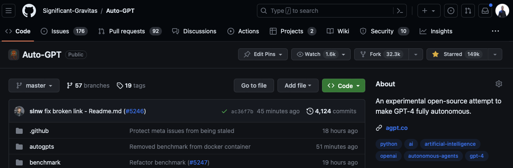
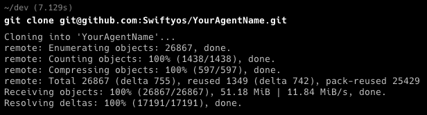
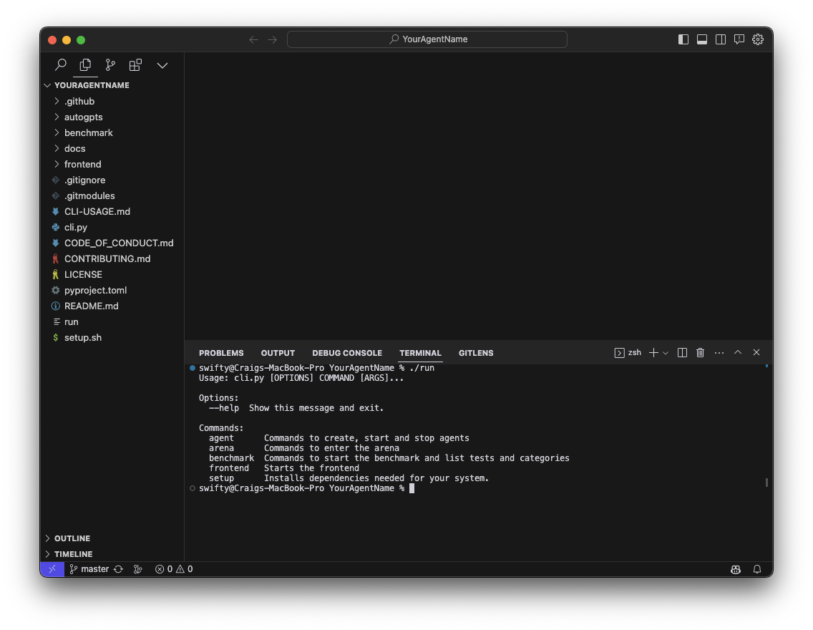
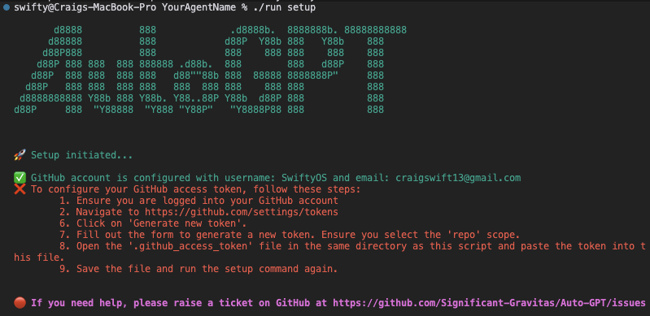
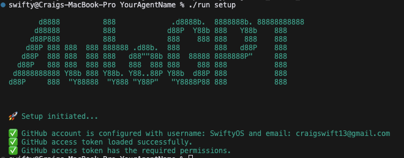
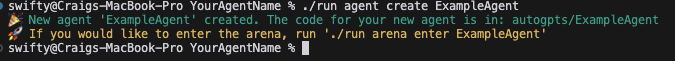
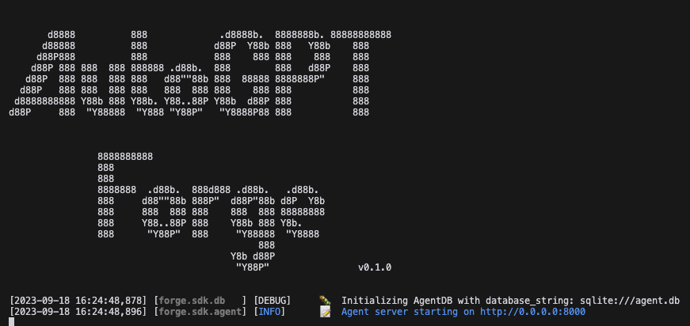
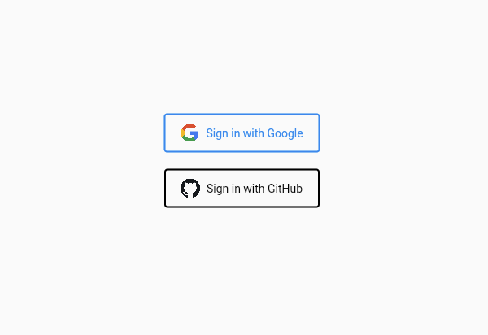
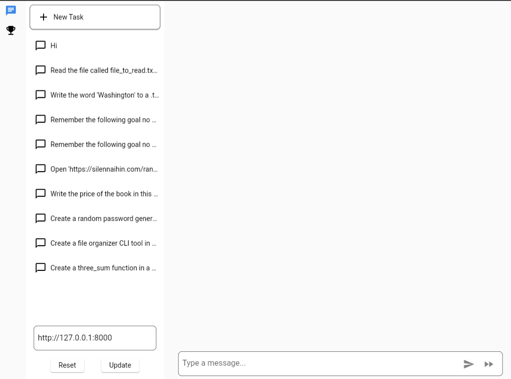
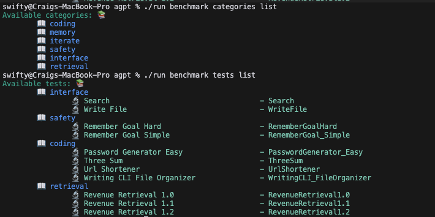

# 快速开始指南

> 完整的入门[教程系列](https://aiedge.medium.com/autogpt-forge-e3de53cc58ec) <- 点击这里

欢迎使用快速开始指南！本指南将带你完成设置和运行自己 AutoGPT 代理的过程。无论你是经验丰富的 AI 开发者还是刚入门，本指南都将提供必要的步骤，帮助你快速开启 AutoGPT 的 AI 开发旅程。

## 系统要求

本项目支持 Linux（基于 Debian）、Mac 和 Windows Subsystem for Linux (WSL)。如果你使用 Windows 系统，需要安装 WSL，安装说明见[此处](https://learn.microsoft.com/en-us/windows/wsl/)。

- Python 版本：3.10 及以上
- 前端（可选）：需要 Flutter 3.x，可按照 [Flutter 官方安装文档](https://docs.flutter.dev/get-started/install) 安装

## 开始设置
1. **Fork 仓库**
   Fork 仓库的步骤如下：
   - 进入仓库主页。

   
   - 在页面右上角点击 Fork。

   
   - 在下一页选择你的 GitHub 账号以创建 fork。
   - 等待 fork 完成。现在你的 GitHub 账号中已有该仓库的副本。

2. **克隆仓库**
   要克隆仓库，你需要在系统中安装 Git。如果尚未安装，可从[这里](https://git-scm.com/downloads)下载。安装完成后，执行以下步骤：
   - 打开终端。
   - 进入希望克隆仓库的目录。
   - 运行刚创建的 fork 的 git clone 命令。

   

   - 然后在你的 IDE 中打开项目。

   

3. **进入仓库目录**
   - 在终端中运行 `cd AutoGPT`（或你克隆的仓库名称）以进入项目根目录。

4. **设置项目**
    接下来我们需要安装所需依赖。我们提供了一个工具帮助你完成仓库中的所有任务。在终端输入 `python scripts/cli.py` 即可访问，也可以在仓库根目录运行 `./run`，或进入 `scripts/` 目录后执行同名脚本。

    首个需要使用的命令是 `python scripts/cli.py setup`（或 `cd scripts && ./run setup`），它会引导你完成系统设置。
    最初你会收到安装 flutter、chrome 以及设置 GitHub 访问令牌的指示，如下图所示：

    > 注意：对于高级用户，GitHub 访问令牌仅在运行 `python scripts/cli.py arena enter`（或 `cd scripts && ./run arena enter`）命令时需要，以便系统能自动创建 PR

    

### Windows 用户

如果你在安装 WSL 后遇到问题，请按照以下步骤解决。

#### 更新 WSL
在 PowerShell 或命令提示符中运行以下命令，以：
1. 启用可选的 WSL 和虚拟机平台组件。
2. 下载并安装最新的 Linux 内核。
3. 将 WSL 2 设置为默认版本。
4. 下载并安装 Ubuntu Linux 发行版（可能需要重启）。

```shell
wsl --install
```

更多详细信息和额外步骤请参阅[微软的 WSL 环境设置文档](https://learn.microsoft.com/en-us/windows/wsl/setup/environment)。

#### 解决 FileNotFoundError 或 “No such file or directory” 错误
运行 `python scripts/cli.py setup`（或 `cd scripts && ./run setup`）时，如果遇到 `No such file or directory` 或 `FileNotFoundError` 等错误，可能是因为 Windows 风格的行结尾（CRLF）与 Unix/Linux 风格的行结尾（LF）不兼容。

要解决此问题，可以使用 `dos2unix` 工具将脚本中的行结尾从 CRLF 转换为 LF。安装并运行 `dos2unix` 的方法如下：

```shell
sudo apt update
sudo apt install dos2unix
dos2unix scripts/run
```

执行上述命令后，运行 `python scripts/cli.py setup`（或 `cd scripts && ./run setup`）应该就能成功。

#### 将项目文件存储在 WSL 文件系统内
如果问题仍然存在，请考虑将项目文件存储在 WSL 文件系统中，而非 Windows 文件系统。这能避免路径转换和权限相关的问题，并提供更一致的开发环境。

你可以多次运行该命令，以获取当前设置进度的反馈。
当设置完成后，命令将输出类似如下内容：



## 创建你的代理

完成设置后，下一步是创建代理模板。
执行命令 `python scripts/cli.py agent create YOUR_AGENT_NAME`（或 `cd scripts && ./run agent create YOUR_AGENT_NAME`），其中 `YOUR_AGENT_NAME` 替换为你选择的名称。

命名代理的提示：
* 给它一个独特的名字，或以你的名字命名
* 在名称中包含代理的重要特性，如其用途

示例：`SwiftyosAssistant`、`PwutsPRAgent`、`Narvis`、`evo.ninja`



### 可选：进入 Arena

进入 Arena 是可选步骤，适用于希望参与代理排行榜的用户。如果你决定参与，可运行 `python scripts/cli.py arena enter YOUR_AGENT_NAME`（或 `cd scripts && ./run arena enter YOUR_AGENT_NAME`）进入 Arena。此步骤对代理的开发或测试并非必需。

名称如 `agent`、`ExampleAgent`、`test_agent` 或 `MyExampleGPT` 的条目不会被合并。我们也不接受使用其他项目名称的模仿条目，如 `AutoGPT` 或 `evo.ninja`。


> **注意**
> 对于高级用户，可创建新分支并在 arena 目录中创建名为 YOUR_AGENT_NAME.json 的文件。随后提交并创建 PR 合并到主仓库。我们只接受单文件条目。json 文件需遵循以下格式：
> ```json
> {
>   "github_repo_url": "https://github.com/Swiftyos/YourAgentName",
>   "timestamp": "2023-09-18T10:03:38.051498",
>   "commit_hash_to_benchmark": "ac36f7bfc7f23ad8800339fa55943c1405d80d5e",
>   "branch_to_benchmark": "master"
> }
> ```
> - `github_repo_url`：你的 fork 地址
> - `timestamp`：此文件最后更新的时间戳
> - `commit_hash_to_benchmark`：参赛所用提交的哈希。每次准备正式提交时都需更新
> - `branch_to_benchmark`：你用于开发代理的分支，默认为 master。

## 运行你的代理

使用 `python scripts/cli.py agent start YOUR_AGENT_NAME`（或 `cd scripts && ./run agent start YOUR_AGENT_NAME`）可以启动代理。

它会在 `http://localhost:8000/` 上启动代理。



前端可通过 `http://localhost:8000/` 访问，你需要先使用 Google 账号或 GitHub 账号登录。



登录后你会看到类似这样的页面：页面左侧为任务历史，右侧的“聊天”窗口用于向代理发送任务。



使用完代理或需要重启时，按 Ctrl-C 结束会话，然后重新运行启动命令。

如果遇到问题并想确保代理已停止，可以使用 `python scripts/cli.py agent stop`（或 `cd scripts && ./run agent stop`），该命令会终止占用 8000 端口的进程，即该代理。

## 为代理运行基准测试

基准测试系统同样可通过 CLI 访问：

```bash
agpt % python scripts/cli.py benchmark
Usage: cli.py benchmark [OPTIONS] COMMAND [ARGS]...

  Commands to start the benchmark and list tests and categories

Options:
  --help  Show this message and exit.

Commands:
  categories  Benchmark categories group command
  start       Starts the benchmark command
  tests       Benchmark tests group command
agpt % python scripts/cli.py benchmark categories
Usage: cli.py benchmark categories [OPTIONS] COMMAND [ARGS]...

  Benchmark categories group command

Options:
  --help  Show this message and exit.

Commands:
  list  List benchmark categories command
agpt % python scripts/cli.py benchmark tests
Usage: cli.py benchmark tests [OPTIONS] COMMAND [ARGS]...

  Benchmark tests group command

Options:
  --help  Show this message and exit.

Commands:
  details  Benchmark test details command
  list     List benchmark tests command
```

基准测试被划分为不同技能类别，可用于测试你的代理。使用以下命令查看可用类别：
```bash
python scripts/cli.py benchmark categories list
# 查看可用测试
python scripts/cli.py benchmark tests list
```



最后，可以通过以下命令运行基准测试：

```bash
python scripts/cli.py benchmark start YOUR_AGENT_NAME

```

