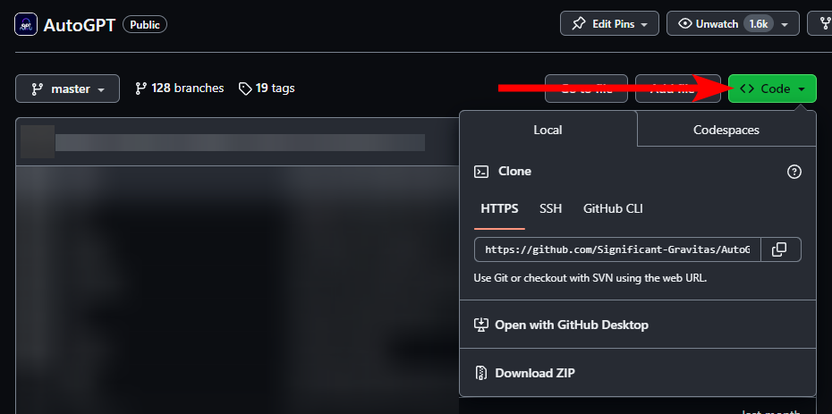

# AutoGPT Agent setup

[🐋 **Set up & Run with Docker**](./docker.md)
&ensp;|&ensp;
[👷🏼 **For Developers**](./for-developers.md)

## 📋 Requirements

### Linux / macOS

- Python 3.10 or later
- Poetry ([instructions](https://python-poetry.org/docs/#installation))

### Windows (WSL)

- WSL 2
  - See also the [requirements for Linux](#linux--macos)
- [Docker Desktop](https://docs.docker.com/desktop/install/windows-install/)

### Windows

!!! attention
    We recommend setting up AutoGPT with WSL. Some things don't work exactly the same on
    Windows and we currently can't provide specialized instructions for all those cases.

- Python 3.10 or later ([instructions](https://www.tutorialspoint.com/how-to-install-python-in-windows))
- Poetry ([instructions](https://python-poetry.org/docs/#installation))
- [Docker Desktop](https://docs.docker.com/desktop/install/windows-install/)


### 🗝️ Getting an OpenAI API key

Get your OpenAI API key from:
[https://platform.openai.com/account/api-keys](https://platform.openai.com/account/api-keys).

!!! attention
    To use the OpenAI API with AutoGPT, we strongly recommend **setting up billing**
    (AKA paid account). Free accounts are [limited][openai/api limits] to 3 API calls per
    minute, which can cause the application to crash.

    You can set up a paid account at [Manage account > Billing > Overview](https://platform.openai.com/account/billing/overview).

[openai/api limits]: https://platform.openai.com/docs/guides/rate-limits/free-tier-rate-limits

!!! important
    It's highly recommended that you keep track of your API costs on [the Usage page](https://platform.openai.com/account/usage).
    You can also set limits on how much you spend on [the Usage limits page](https://platform.openai.com/account/billing/limits).


## Setting up AutoGPT

### Getting AutoGPT

Since we don't ship AutoGPT as a desktop application, you'll need to download the
[project] from GitHub and give it a place on your computer.



* To get the latest bleeding edge version, use `master`.
* If you're looking for more stability, check out the latest AutoGPT [release][releases].

[project]: https://github.com/Significant-Gravitas/AutoGPT
[releases]: https://github.com/Significant-Gravitas/AutoGPT/releases

!!! note
    These instructions don't apply if you're looking to run AutoGPT as a docker image.
    Instead, check out the [Docker setup](./docker.md) guide.

### Completing the Setup

Once you have cloned or downloaded the project, you can find the AutoGPT Agent in the
`autogpts/autogpt/` folder. In this folder:

1. Find the file named `.env.template`. This file may
    be hidden by default in some operating systems due to the dot prefix. To reveal
    hidden files, follow the instructions for your specific operating system:
    [Windows][show hidden files/Windows] and [macOS][show hidden files/macOS].
2. Create a copy of `.env.template` and call it `.env`;
    if you're already in a command prompt/terminal window:
    ```shell
    cp .env.template .env
    ```
3. Open the `.env` file in a text editor.
4. Find the line that says `OPENAI_API_KEY=`.
5. Insert your OpenAI API Key directly after = without quotes or spaces..
    ```yaml
    OPENAI_API_KEY=sk-qwertykeys123456
    ```

    !!! info "Using a GPT Azure-instance"
        If you want to use GPT on an Azure instance, set `USE_AZURE` to `True` and
        make an Azure configuration file.

        Rename `config/azure.yaml.template` to `config/azure.yaml` and provide the relevant
        `azure_api_base`, `azure_api_version` and deployment IDs for the models that you
        want to use.

        E.g. if you want to use `gpt-3.5-turbo-16k` and `gpt-4-0314`:

        ```yaml
        # Please specify all of these values as double-quoted strings
        # Replace string in angled brackets (<>) to your own deployment Name
        azure_model_map:
            gpt-3.5-turbo-16k: "<auto-gpt-deployment>"
            ...
        ```

        Details can be found in the [openai-python docs], and in the [Azure OpenAI docs] for the embedding model.
        If you're on Windows you may need to install an [MSVC library](https://learn.microsoft.com/en-us/cpp/windows/latest-supported-vc-redist?view=msvc-170).

6. Enter any other API keys or tokens for services you would like to use.

    !!! note
        To activate and adjust a setting, remove the `# ` prefix.

7. Save and close the `.env` file.
8. _Optional: run `poetry install` to install all required dependencies._ The
    application also checks for and installs any required dependencies when it starts.

You should now be able to explore the CLI (`./autogpt.sh --help`) and run the application.

See the [user guide](../usage.md) for further instructions.

[show hidden files/Windows]: https://support.microsoft.com/en-us/windows/view-hidden-files-and-folders-in-windows-97fbc472-c603-9d90-91d0-1166d1d9f4b5
[show hidden files/macOS]: https://www.pcmag.com/how-to/how-to-access-your-macs-hidden-files
