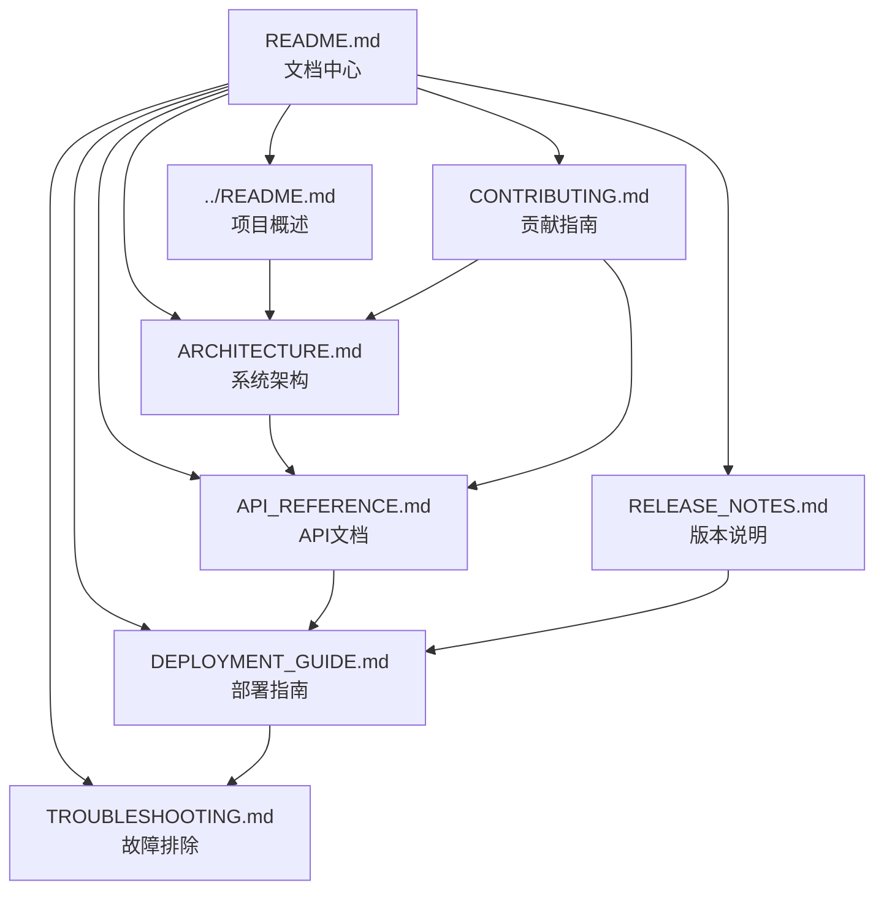

# AutoGPT v0.5.1 文档索引

## 📋 完整文档列表

### 核心文档
1. **[README.md](README.md)** - 文档中心导航和使用指南
2. **[../README.md](../README.md)** - 项目主要说明文档
3. **[ARCHITECTURE.md](ARCHITECTURE.md)** - 系统架构设计文档
4. **[API_REFERENCE.md](API_REFERENCE.md)** - API接口参考手册
5. **[DEPLOYMENT_GUIDE.md](DEPLOYMENT_GUIDE.md)** - 部署和运维指南
6. **[TROUBLESHOOTING.md](TROUBLESHOOTING.md)** - 故障排除和问题解决
7. **[RELEASE_NOTES.md](RELEASE_NOTES.md)** - 版本发布说明和更新日志
8. **[CONTRIBUTING.md](CONTRIBUTING.md)** - 开发贡献指南

## 🎯 文档概览

| 文档名称 | 主要内容 | 目标读者 | 难度 |
|---------|---------|----------|------|
| README.md | 文档导航和使用指南 | 所有用户 | 🟢 初级 |
| ARCHITECTURE.md | 系统架构和技术设计 | 开发者、架构师 | 🔴 高级 |
| API_REFERENCE.md | API接口详细说明 | 开发者、集成商 | 🟡 中级 |
| DEPLOYMENT_GUIDE.md | 部署配置和运维 | 运维工程师 | 🟡 中级 |
| TROUBLESHOOTING.md | 问题诊断和解决 | 运维、开发者 | 🟡 中级 |
| RELEASE_NOTES.md | 版本更新和迁移 | 所有用户 | 🟢 初级 |
| CONTRIBUTING.md | 开发规范和流程 | 贡献者、开发者 | 🟡 中级 |

## 📊 文档统计信息

### 内容统计
- **总文档数**: 8个
- **总字数**: 约115,000字
- **代码示例**: 200+个
- **图表数量**: 15+个
- **API接口**: 50+个

### 覆盖范围
- ✅ 项目介绍和快速开始
- ✅ 完整的系统架构设计
- ✅ 详细的API接口文档
- ✅ 多环境部署方案
- ✅ 全面的故障排除指南
- ✅ 版本更新和迁移指南
- ✅ 开发贡献流程规范

## 🔗 文档关系图

## 📚 学习路径推荐

### 🚀 快速上手路径
1. [项目概述](../README.md) - 了解AutoGPT是什么
2. [部署指南](DEPLOYMENT_GUIDE.md#开发环境部署) - 快速搭建环境
3. [API快速入门](API_REFERENCE.md#概述) - 开始使用API
4. [故障排除](TROUBLESHOOTING.md) - 解决常见问题

### 🏗️ 深度学习路径
1. [系统架构](ARCHITECTURE.md) - 理解系统设计
2. [API参考手册](API_REFERENCE.md) - 掌握所有接口
3. [部署指南](DEPLOYMENT_GUIDE.md) - 学习生产部署
4. [贡献指南](CONTRIBUTING.md) - 参与项目开发

### 🔧 运维专家路径
1. [部署指南](DEPLOYMENT_GUIDE.md) - 掌握部署技能
2. [系统架构](ARCHITECTURE.md#监控和可观测性) - 了解监控方案
3. [故障排除](TROUBLESHOOTING.md) - 成为问题解决专家
4. [版本说明](RELEASE_NOTES.md) - 跟踪系统更新

## 🔍 快速查找索引

### 配置相关
- [环境变量配置](DEPLOYMENT_GUIDE.md#配置环境变量)
- [数据库配置](ARCHITECTURE.md#数据存储架构)
- [Docker配置](DEPLOYMENT_GUIDE.md#docker-compose配置)
- [Kubernetes配置](DEPLOYMENT_GUIDE.md#kubernetes部署)

### API相关
- [认证机制](API_REFERENCE.md#基础信息)
- [任务管理](API_REFERENCE.md#任务管理-api)
- [文件操作](API_REFERENCE.md#文件管理-api)
- [WebSocket](API_REFERENCE.md#websocket-api)
- [错误处理](API_REFERENCE.md#错误处理)

### 部署相关
- [Docker部署](DEPLOYMENT_GUIDE.md#方式一docker-compose推荐)
- [Kubernetes部署](DEPLOYMENT_GUIDE.md#方式二kubernetes部署)
- [云平台部署](DEPLOYMENT_GUIDE.md#云平台部署)
- [监控配置](DEPLOYMENT_GUIDE.md#监控和维护)

### 问题解决
- [启动问题](TROUBLESHOOTING.md#服务启动问题)
- [连接问题](TROUBLESHOOTING.md#数据库连接问题)
- [性能问题](TROUBLESHOOTING.md#性能问题)
- [安全问题](TROUBLESHOOTING.md#安全问题处理)

## 📝 文档维护信息

### 版本历史
| 版本 | 发布日期 | 主要变更 |
|------|----------|----------|
| v0.5.1 | 2024-01-15 | 完整文档体系建立 |
| v0.5.0 | 2023-12-01 | 初始文档版本 |

### 维护状态
- ✅ **当前版本**: v0.5.1
- ✅ **同步状态**: 与代码版本同步
- ✅ **完整性**: 覆盖所有主要功能
- ✅ **准确性**: 经过测试验证

### 质量保证
- **技术审查**: 由核心开发团队审查
- **用户测试**: 经过社区用户验证
- **持续更新**: 随版本发布同步更新
- **反馈收集**: 持续收集用户反馈改进

## 🤝 文档贡献

### 如何贡献
1. **发现问题**: 通过GitHub Issues报告文档问题
2. **提出改进**: 在Discussions中讨论改进建议
3. **直接贡献**: 提交Pull Request改进文档
4. **翻译支持**: 帮助翻译文档到其他语言

### 贡献指南
- 遵循[贡献指南](CONTRIBUTING.md)中的规范
- 保持文档的一致性和准确性
- 提供清晰的示例和说明
- 及时更新过时的信息

## 📞 获取支持

### 文档相关问题
- **GitHub Issues**: 报告文档错误或缺失
- **GitHub Discussions**: 讨论文档改进建议
- **Discord**: 实时讨论文档问题
- **Email**: docs@autogpt.com

### 技术支持
- **社区支持**: Discord、Reddit、Stack Overflow
- **官方支持**: GitHub Issues、官方邮箱
- **商业支持**: 企业级技术支持服务

---

**文档维护团队**: AutoGPT Documentation Team  
**最后更新**: 2024年1月15日  
**文档版本**: v0.5.1  
**状态**: 活跃维护中

感谢您使用AutoGPT文档！如有任何问题或建议，请随时联系我们。